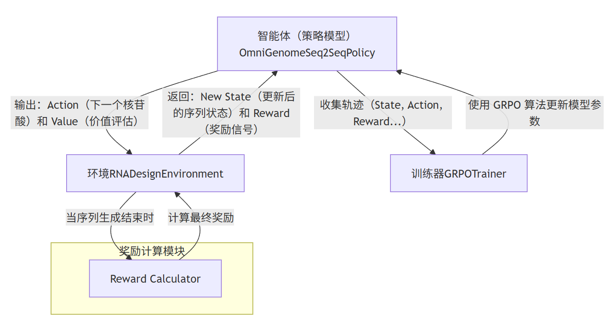

# OmniGenome-GRPO: A Reinforcement Learning Framework for RNA Design


This repository contains the official implementation of **OmniGenome-GRPO**, a high-performance deep reinforcement learning framework designed to solve the RNA inverse folding problem. The goal is to design an RNA nucleotide sequence that folds into a desired target secondary structure.

This framework uses a powerful sequence-to-sequence (Seq2Seq) model as the policy agent and trains it using Group-relative Policy Optimization (GRPO), an efficient variant of PPO.

## Framework Architecture

The entire process is modeled as an agent-environment interaction loop, which is the core of the reinforcement learning approach.



## Key Features

- **Advanced Policy Model**: Utilizes a Transformer-based Seq2Seq model, `OmniGenomeForSeq2SeqWithValueHead`, which acts as the policy and includes a value head for actor-critic learning.

- **Sophisticated Reward System**: The reward function is multi-faceted for robust learning.
  - It primarily uses the F1 score to measure the similarity between the folded structure of the generated sequence and the target structure.
  - It uniquely incorporates a pre-trained language model scorer (LMScorer) to evaluate the semantic consistency between the generated sequence and the structure, guiding the design towards more biologically plausible results.
  - It includes configurable sub-rewards for GC content and sequence diversity.

- **Efficient Training Algorithm**: Implements Group-relative Policy Optimization (GRPO), an efficient PPO variant designed for batch training. The trainer features highly optimized, parallel data collection (`rollout_parallel`) and vectorized policy updates (`_recompute_traj_logp`) to maximize hardware utilization.

- **Vectorized Environment**: The `RNADesignEnvironment` is fully vectorized, supporting parallel rollouts for a given target structure to significantly accelerate the collection of training data.

- **Performance and Memory Optimized**:
  - Integrates mixed-precision training using `torch.amp.autocast` and `GradScaler` to reduce memory footprint and speed up computation on compatible GPUs.
  - Includes explicit GPU cache clearing and garbage collection to handle large models and prevent memory leaks during long training runs.
  - A `--memory-efficient` mode is available to automatically adjust batch sizes and update frequencies for low-VRAM environments.

## File Structure

The project is organized into several key modules:

- `main_training.py`: The main entry point to start the training and evaluation process.
- `grpo_trainer.py`: Contains the implementation of the GRPO training algorithm, including data collection and policy updates.
- `omnigenome_model.py`: Defines the `OmniGenomeSeq2SeqPolicy` agent, which is built on a Transformer architecture with a value head.
- `rna_environment.py`: Implements the vectorized environment for RNA design.
- `reward_calculator.py`: Defines the reward function, including structure similarity, thermodynamic stability, and LM-based scoring.
- `config_utils.py`: Manages experiment configurations, logging, and other utilities.
- `gpu_optimizer.py`: Provides tools for optimizing GPU utilization.
- `memory_utils.py`: Contains memory management utilities to prevent leaks.
- `OmniGenome/`: The directory for the core OmniGenome model components.

## Setup and Installation

1. **Clone the repository**:

   ```bash
   git clone [https://your-repository-url.com/OmniGenome-GRPO.git](https://your-repository-url.com/OmniGenome-GRPO.git)
   cd OmniGenome-GRPO
   ```

2. **Create a Python virtual environment (recommended)**:

   ```bash
   python -m venv venv
   source venv/bin/activate  # On Windows, use `venv\Scripts\activate`
   ```

3. **Install dependencies**:
   The core dependencies are listed in `requirements.txt`.

   ```bash
   pip install -r requirements.txt
   ```

   **Note**: For the structural prediction part of the reward function, installing ViennaRNA is highly recommended for better accuracy. Please follow its official installation guide.

## Usage

1. **Configuration**:
   All experiment parameters, such as learning rates, model dimensions, and reward weights, are controlled via a YAML configuration file (e.g., `default_config.yaml`). You can copy and modify the default configuration for your experiments.

2. **Running the Training**:
   To start training, run the main script and point it to your configuration file.

   ```bash
   python main_training.py --config /path/to/your/config.yaml
   ```

   **Command-line arguments**:
   - `--config`: Path to the experiment's YAML configuration file.
   - `--device`: Specify the computation device (cpu, cuda, auto). Defaults to auto.
   - `--memory-efficient`: Enable memory-saving mode, which reduces batch size and adjusts update frequency.

3. **Evaluation**:
   The `evaluate_model` function is called periodically during training to assess the model's performance using a greedy decoding strategy.

## Outputs

The framework will generate the following outputs in the specified directories (`model_save_path`, `result_save_path`, `log_save_path` in your config):

- **Saved Models**: Checkpoints (.pt files) of the model at regular intervals and the best-performing model.
- **Training Statistics**: JSON files (`training_stats.json`, `final_results.json`) containing detailed logs of rewards, losses, and other metrics.
- **Training Curves**: A plot (`training_curves.png`) visualizing the training progress, including rewards and losses over time.
- **Log Files**: A detailed log file (.log) capturing all events during the training run.

## License

This project is licensed under the MIT License. See the LICENSE file for details.